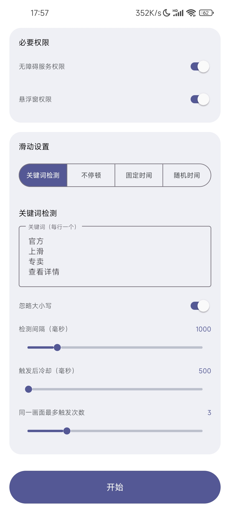

# Android Auto-Slide App [AutoSlide]

[简体中文](README.md) | [English](README.en.md)

An Android auto-slide tool for automated testing and content browsing

## Features

- **Slide Modes**: Offers four modes ⌈No Pause / Fixed Time / Random Time / Keyword Detection⌋
- **Keyword Detection**: Detects keywords on screen via OCR and swipes automatically (supports multiple keywords, case-insensitive matching, cooldown and trigger limits)
- **Slide Speed**: Multiple speed levels with a smooth gesture duration curve
- **Slide Direction**: Supports up down left and right
- **Custom Trajectory**: Long-press a direction button to record the swipe path for that direction and replay it during auto slide
- **Floating Window Control**: Start or stop via the floating ball with auto collapse while running
- **Quick Settings Tile**: Toggle the floating window service from system quick settings
- **Safe Stop**: Supports volume key force stop and auto stop on screen off
- **Permission Management**: Enable accessibility via ⌈Manual / Shizuku / ADB⌋

## Screenshots

## Quick Start

### Prerequisites

- Android 8.0 or higher

### Installation

1. Download the latest APK file from the [Releases Page](https://github.com/tianxing-ovo/AutoSlide/releases/)
2. Open the downloaded APK file and follow the on-screen instructions to install the application
3. Launch the app and grant the necessary permissions for proper functionality

## Contributing

Issues and pull requests are welcome

## License

This project is licensed under the [Apache License 2.0](LICENSE)
